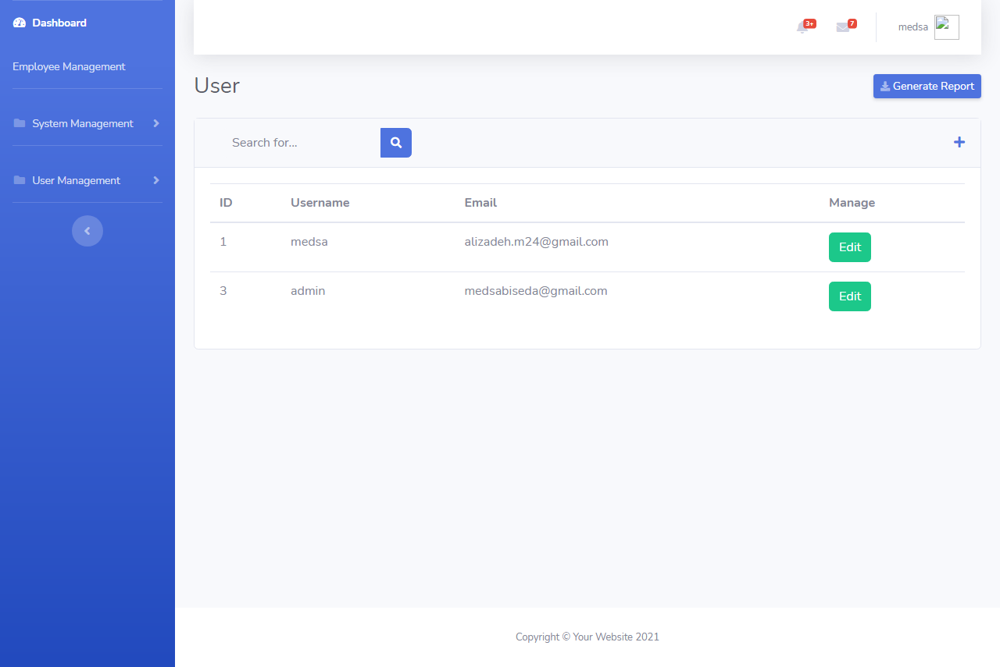

    # Employees Management Application Test

## Programing Fremework & Database
1. Use Laravel 8 franwork as development platform.
2. Mysql 5 or later as database.
3. Vue js and laravel mix for compiing assets . Implement vue.js in employee management only
4. Bootstrap 4

## User Interface
1. Interface should be responsive based on HTML5 and bootstrap 4.
2. User interface layout should have side bar menu and header.
    1.On side bar the following should be displayed as vertical menu
        1.Dashboard
        2.Employee Management
        3.System Management

3. User managment 
    3.1 User (sub menu)
    3.2 User (sub menu - optional )
    3.3 Permission (sub menu - optional )
4. On header interface. display the name of the logged in user as well as the menu for logout

## Packages
- [Laravel UI](https://github.com/laravel/ui)

## Requirements
- PHP 7.3/8

## Todo
- [x] ~~Create Panel Admin By bootsrap 4~~

## Credits
- All Contributors

## License
The MIT License [MIT license](https://opensource.org/licenses/MIT). Please see License File for more information.

## Screenshots
-Admin dashboard

